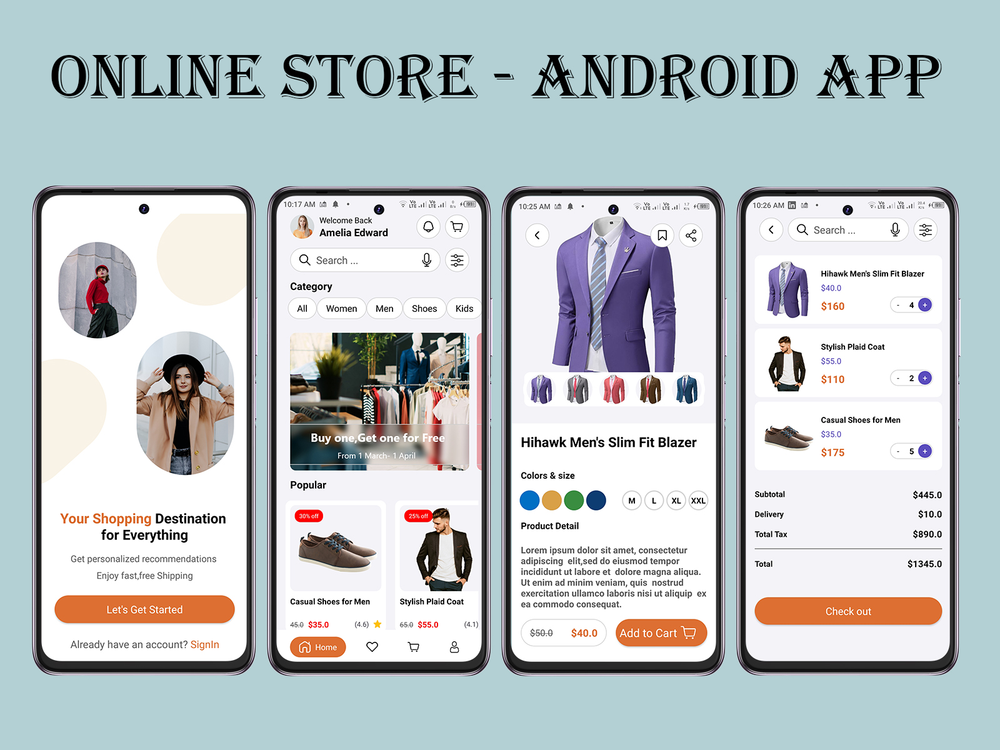

# Online Store - Android Application

An Android shopping app that allows users to browse products, add them to cart, and complete purchases with ease.  
Built using Java, Firebase Realtime Database, and follows the MVVM architecture for clean and maintainable code.

---

## 📱 App Features

- Browse products with smooth and dynamic lists using RecyclerView.  
- Real-time product and user data synchronization with Firebase Realtime Database.  
- User authentication with Firebase Authentication (optional).  
- Add/remove products to/from the shopping cart.  
- Clean separation of UI and business logic using MVVM architecture with ViewModel and LiveData.  
- Modern UI design following Material Design principles.  
- Supports dynamic data updates without app restart.

---

## 🛠️ Built With

- **Java** – Core app logic  
- **Firebase Realtime Database** – Cloud data storage and sync  
- **Firebase Authentication** – User login and registration  
- **Android Studio** – Development IDE  
- **Android Jetpack Components** – ViewModel, LiveData  
- **RecyclerView** – Dynamic product listing  
- **Material Design** – UI components and themes  

---

## 📸 Screenshots

  

---

## 🚀 Getting Started

To run the project locally:

1. Clone the repository  
2. Open it in Android Studio  
3. Add your Firebase configuration file (`google-services.json`) to the `app/` directory  
4. Build and run the app on a physical device or emulator  

---

## 📋 Project Structure

- `model/` – Data models representing products, users, and cart items  
- `view/` – Activities and Fragments for UI  
- `viewmodel/` – ViewModels managing UI-related data and business logic  
- `repository/` – Data management layer interacting with Firebase  
- `utils/` – Helper functions and utilities  

---

## 📌 Notes

- The app uses Firebase for real-time data updates and user authentication.  
- MVVM architecture helps keep the code modular and easy to maintain.  
- You can extend the app by adding features like order history, product reviews, and payment integration.

---

## 🤝 Contributing

Feel free to contribute by submitting issues or pull requests.  
Your feedback and improvements are welcome!

---

## 📄 License

This project is licensed under the MIT License.

---

## 🙌 Author

Developed by **Ramzy Ahmed**  
Connect with me on [LinkedIn](https://www.linkedin.com/in/ramzy-ahmed)
